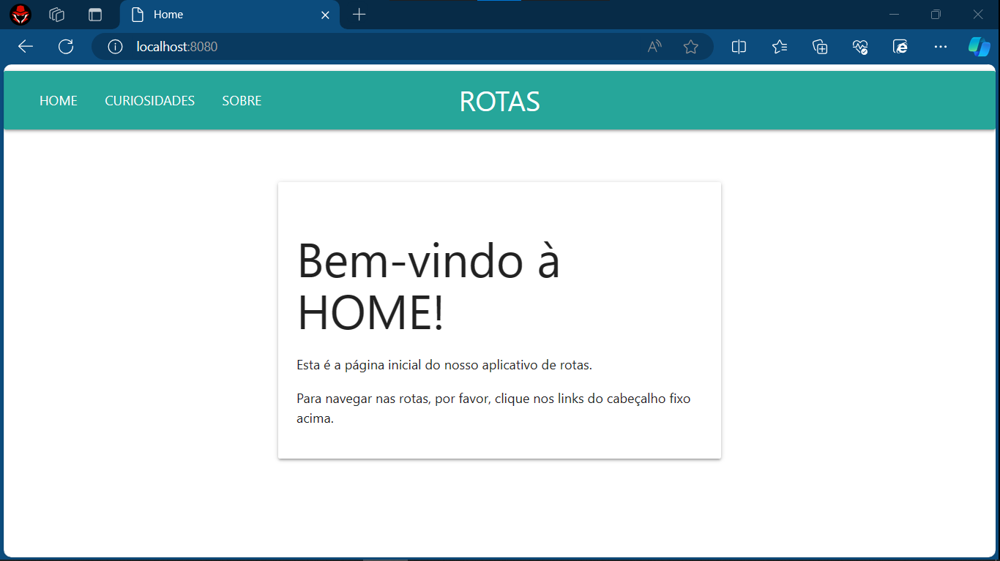
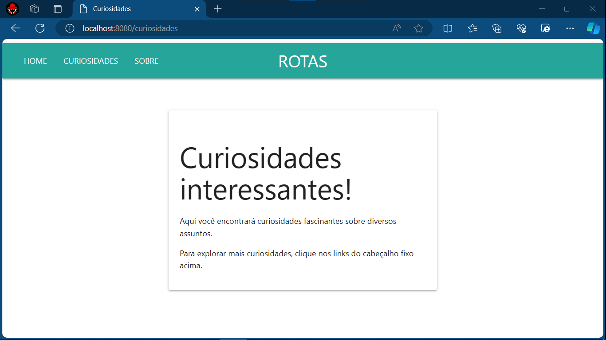
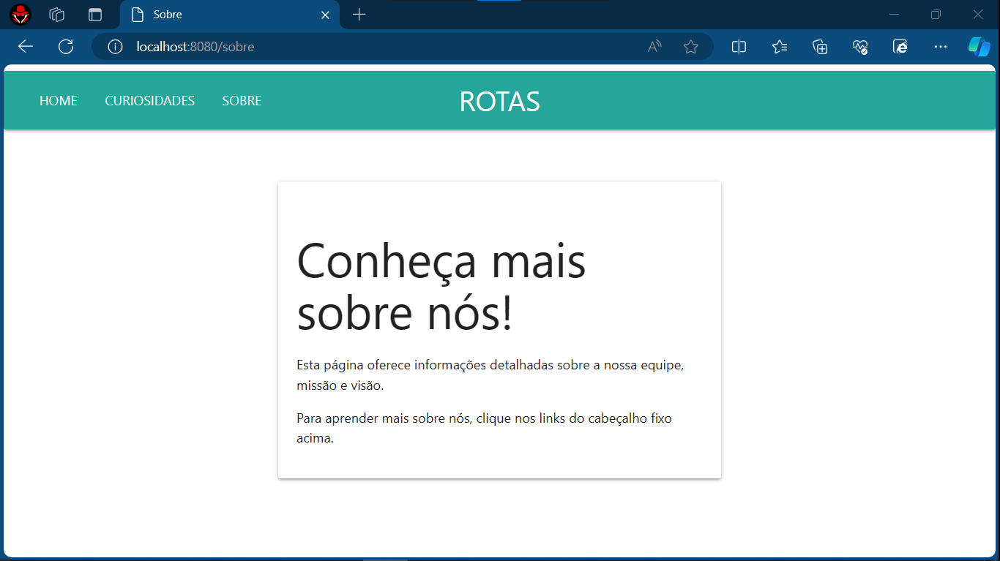

# ROTAS COM GOLANG 
👨‍💻APLICAÇÃO DE ROTAS APENAS COM A LIGUAGEM, SEM FRAMEWORKS!

 <br>
 <br>
 <br>

## DESCRIÇÃO:
- Este aplicativo web simples implementado em Go, utilizando MaterializeCSS para o frontend, serve como uma interface para navegar em diferentes rotas.

- Este aplicativo web é uma demonstração simples de como implementar roteamento de páginas em Go, utilizando MaterializeCSS para estilização, e oferece uma maneira fácil e intuitiva de explorar diferentes seções do aplicativo através de um cabeçalho fixo.

## RECURSOS:
1. **Roteamento de Páginas**: O aplicativo possui três páginas principais acessíveis através do cabeçalho fixo: HOME, CURIOSIDADES e SOBRE. Cada uma dessas páginas corresponde a uma rota específica.

2. **Página HOME**: A página inicial apresenta uma breve mensagem de boas-vindas e instruções sobre como navegar nas rotas usando os links no cabeçalho fixo.

3. **Página CURIOSIDADES**: A página de curiosidades exibe informações interessantes sobre vários assuntos. Assim como na página HOME, também fornece instruções para navegar nas rotas.

4. **Página SOBRE**: A página "Sobre" oferece detalhes sobre a equipe por trás do aplicativo, sua missão e visão.

5. **Cabeçalho Fixo Personalizado**: O cabeçalho fixo na parte superior da página apresenta o nome "ROTAS" centralizado, fornecendo uma navegação consistente entre as diferentes páginas.

## EXECUTANDO O PROJETO:
1. Para iniciar o servidor, execute o arquivo em `./CODIGO/main.go` com um dos seguintes comandos no terminal:
   ```bash
   go run .
   ```
   ou
   ```bash
   go run main.go
   ```

2. Após iniciar o servidor, acesse o projeto no navegador utilizando o seguinte URL: [http://localhost:8080/](http://localhost:8080/).

## NÃO SABE?
- Entendemos que para manipular arquivos em muitas linguagens e tecnologias, é necessário possuir conhecimento nessas áreas. Para auxiliar nesse aprendizado, oferecemos alguns subsidios:
* [CURSO DE GOLANG](https://github.com/VILHALVA/CURSO-DE-GOLANG)
* [CURSO DE HTML E CSS](https://github.com/VILHALVA/CURSO-DE-HTML-E-CSS)
* [CURSO DE MATERIALIZECSS](https://github.com/VILHALVA/CURSO-DE-MATERIALIZECSS)
* [VEJA A DOCUMENTAÇÃO DO "NET/HTTP"](https://pkg.go.dev/net/http)
* [CONFIRA MAIS CURSOS](https://github.com/VILHALVA?tab=repositories&q=+topic:CURSO)

## CREDITOS:
- [PROJETO CRIADO PELO VILHALVA](https://github.com/VILHALVA)

